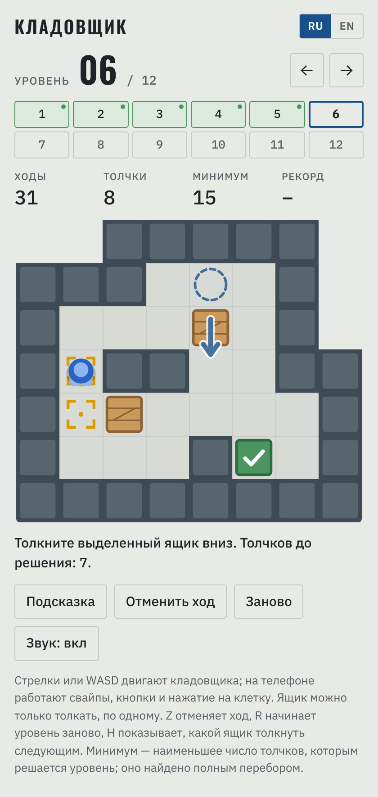
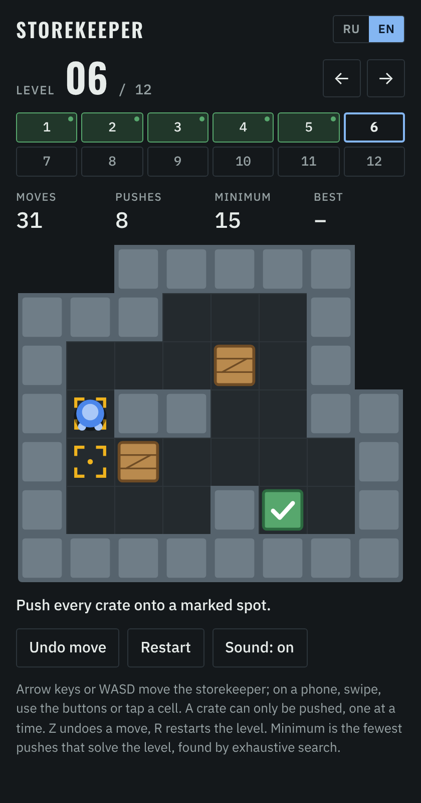

# Storekeeper

[Русская версия](README.ru.md)

A browser puzzle with the rules of Sokoban. The storekeeper pushes crates around a warehouse, and a level is solved when every crate stands on a marked spot. There are twelve original levels, each with a proven minimum number of pushes.

**[Play in the browser](https://posoxai.github.io/StorekeeperGame/)**

<p>
  
  
</p>

Left: the light theme with the Russian interface and a hint showing. Right: the dark theme with the English interface.

## Rules

- The storekeeper moves horizontally and vertically, one cell per move.
- A crate can only be pushed. It cannot be pulled.
- One crate is pushed at a time. If a wall or another crate is behind it, it does not move.
- A level is solved when every crate stands on a marked spot.

Moves can be undone without limit, so a dead end is not a loss.

## Levels

There are twelve levels, all open from the start.

| Level | Crates | Minimum pushes |
| --- | --- | --- |
| 1 | 2 | 4 |
| 2 | 2 | 6 |
| 3 | 2 | 9 |
| 4 | 2 | 11 |
| 5 | 3 | 13 |
| 6 | 3 | 15 |
| 7 | 3 | 17 |
| 8 | 3 | 18 |
| 9 | 3 | 22 |
| 10 | 4 | 23 |
| 11 | 4 | 24 |
| 12 | 4 | 27 |

The levels are original, made for this game. Each one was produced like this: for a chosen room and a placement of the marked spots, a program went through every position from which the level can be solved and found the exact minimum number of pushes for each. A position of the wanted difficulty went into the game.

The minimum in the table was checked by a second, independent solver, and the solutions it found were replayed in the game itself.

The levels are ordered by the number of pushes. How hard they feel may not rise as evenly.

### Generator and checker

Both scripts are in `tools/` and run in Node.js with no dependencies.

```
node tools/generate-levels.js
node tools/verify-levels.js
```

- `generate-levels.js` rebuilds all twelve levels and prints the board, the minimum pushes and a solution for each. The run is deterministic: it produces exactly the levels that ship in the game. It takes about fifteen seconds. With `--json` it prints the same as JSON.
- `verify-levels.js` reads the levels from `index.html` and finds the minimum pushes for each by a forward search. It shares no code with the generator. If a level cannot be solved, or the minimum differs from the one stored in the game, the script exits with an error.

The rooms, the level list and the random seeds are at the top of `generate-levels.js`. Change them to get different levels.

## Controls

- Keyboard: arrow keys or WASD. Z or Backspace undoes a move, R restarts the level, H shows a hint.
- Phone: swipe on the board, use the arrow buttons under it, or tap a cell. The storekeeper walks to a free cell by the shortest path.
- Mouse: a click on a neighbouring cell takes one step, and a click on a distant cell walks the storekeeper there.

### Hint

The Hint button or the H key shows the next push: an arrow on a crate says which way to move it, and a dashed ring marks where to stand for that. The status line says how many pushes remain. The hint always follows a shortest solution, so playing by hints alone solves a level in exactly the minimum number of pushes.

If the position can no longer be solved, the game says how many moves to go back. A second press of the same button takes them back for you.

A run that used a hint does not count: the level is not marked as solved and the result does not become a best. A "hint used" flag appears next to the level number. It stays until the end of the attempt and survives a page reload; only Restart, or opening the level again, clears it. A best earned earlier without a hint stays in place.

The hint is computed in the browser by the same reverse search the generator uses. The first request on a level takes a fraction of a second, and the following ones answer at once.

The game counts moves and pushes and remembers the best result for every level. The current position, the solved levels and the bests are kept in the player's browser.

The Reset records button under the notes clears the solved marks and the bests. They cannot be brought back, so the first press only asks and the second one clears. The current position on the level stays.

## Language

The interface is in English and Russian. It opens in Russian when Russian is among the browser's languages and in English otherwise. The RU/EN switch remembers your choice.

## How to run

The whole game is one file, `index.html`. There is no build step and there are no dependencies.

- Locally: open `index.html` in a browser.
- Online: the game is published with GitHub Pages at https://posoxai.github.io/StorekeeperGame/. Every commit to `main` updates it automatically.

Fonts load from Google Fonts. Without a network the game falls back to system fonts.

Levels are stored in `index.html` in the usual Sokoban notation: `#` wall, `@` storekeeper, `$` crate, `.` marked spot, `*` crate on a spot, `+` storekeeper on a spot.

## Credits

The game was written by Claude, the AI assistant made by Anthropic: the logic, the level generator and checker, the canvas graphics, the sound and the page design.

The rules belong to Sokoban, created in 1981 by Hiroyuki Imabayashi and published in 1982 by Thinking Rabbit. The levels, the graphics and the name of this version are its own; only the rules come from the original.

The idea of making a browser version came from posoxAI.

## License

MIT. The full text is in [LICENSE](LICENSE).
